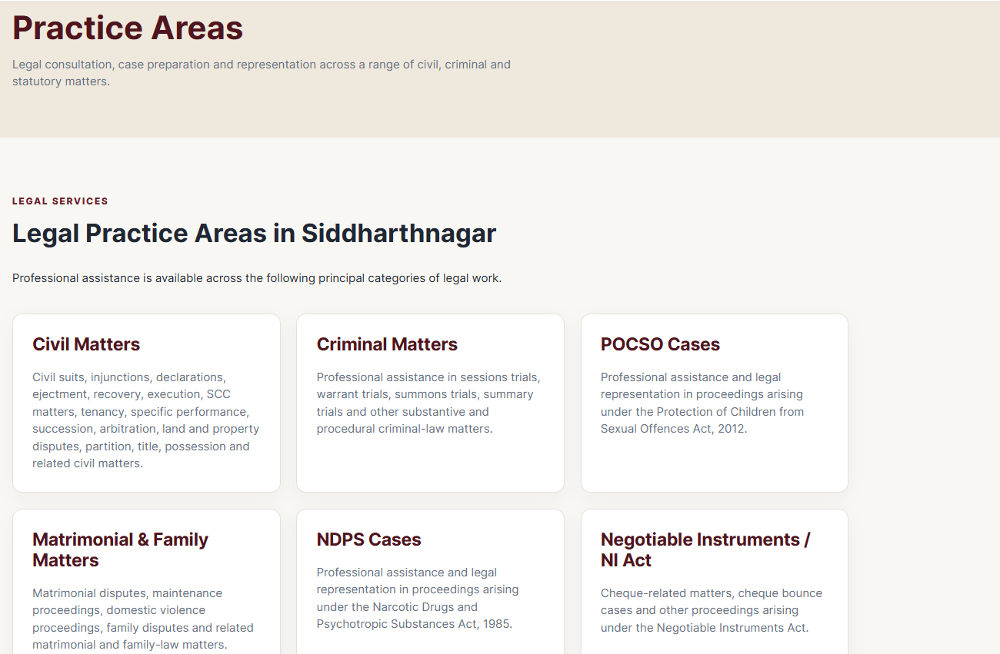
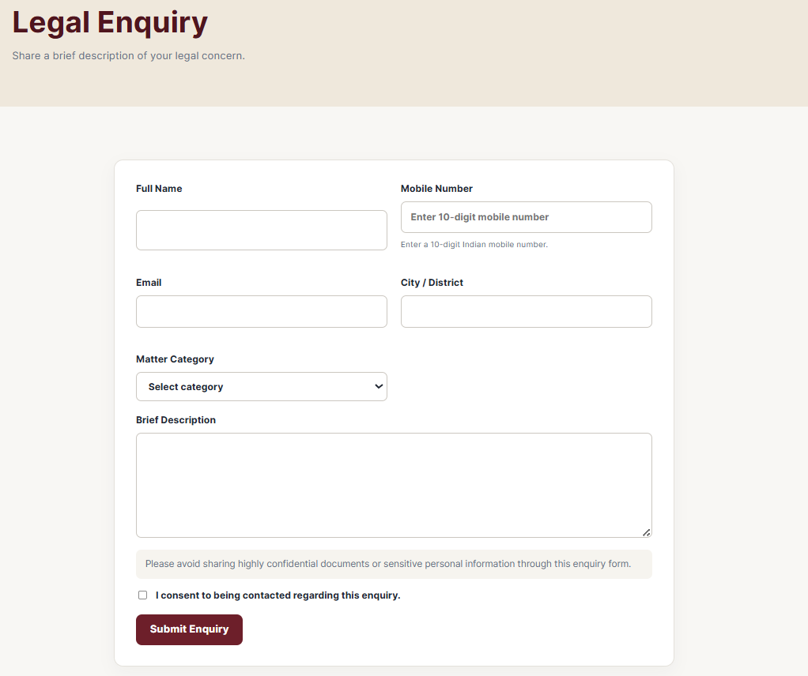
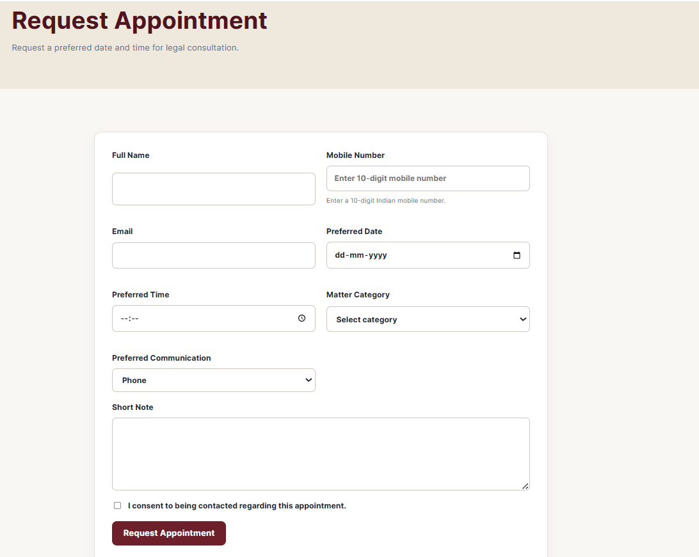
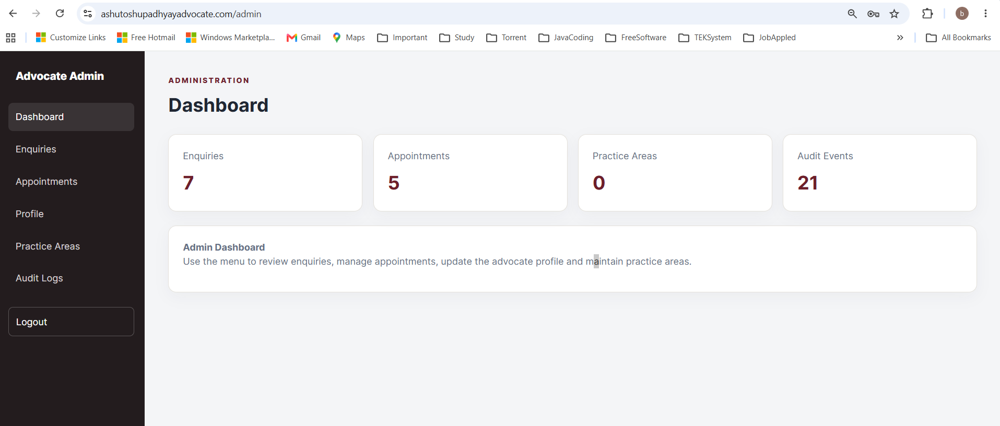
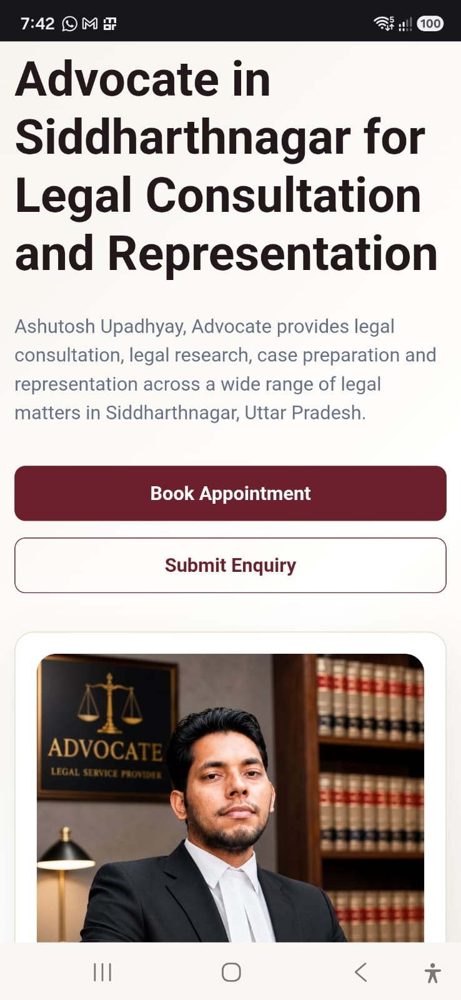

# ⚖️ Ashutosh Upadhyay Advocate — Full-Stack Production Web Application

[](https://www.ashutoshupadhyayadvocate.com)
[](https://github.com/Upadhyaybn/ashutosh-upadhyay-advocate/releases/tag/v1.0.0)
[](https://www.oracle.com/java/)
[](https://spring.io/projects/spring-boot)
[](https://react.dev/)
[](https://www.postgresql.org/)
[](https://aws.amazon.com/)
[](https://www.docker.com/)

A production-grade full-stack web application independently designed, developed, tested, secured, deployed, and productionized for a practicing legal professional in Siddharthnagar, Uttar Pradesh, India.

This project demonstrates end-to-end ownership across **Java backend engineering, React frontend development, REST API design, authentication and authorization, relational database design, automated testing, Docker containerization, AWS deployment, HTTPS, SEO, responsive UI, monitoring, backup, and production operations**.

🌐 **Live Application:**  
https://www.ashutoshupadhyayadvocate.com

🔗 **Production API:**  
https://api.ashutoshupadhyayadvocate.com

🏷️ **Production Release:** `v1.0.0`

---

## 📌 Project Overview

The application was developed for **Ashutosh Upadhyay, Advocate**, practicing in Siddharthnagar, Uttar Pradesh.

It provides both a public-facing professional website and a secured administration system.

Public users can:

- View the advocate's professional profile
- Browse legal practice areas
- Submit legal enquiries
- Request consultation appointments
- Access office and contact information
- Use the application across desktop, tablet, and mobile devices

Authorized administrators can:

- Securely authenticate
- View dashboard statistics
- Review enquiries
- Update enquiry statuses
- Review appointment requests
- Update appointment statuses
- Maintain advocate profile information
- Maintain practice areas
- Review audit events

The project was taken through the complete software development lifecycle:

**Requirements → Architecture → Backend → Database → Frontend → Security → Testing → Docker → CI/CD → AWS → Domain → HTTPS → SEO → Production QA → Monitoring → Backup → Release**

---

# 🏗️ Architecture

```text
                         Internet
                            │
                            ▼
             ashutoshupadhyayadvocate.com
                            │
                 ┌──────────┴──────────┐
                 │                     │
                 ▼                     ▼
        www.ashutosh...          api.ashutosh...
                 │                     │
                 ▼                     ▼
          AWS Amplify              Nginx / HTTPS
                 │                     │
                 ▼                     ▼
        React + TypeScript        Docker Container
                                       │
                                       ▼
                              Spring Boot REST API
                                       │
                              Spring Security + JWT
                                       │
                                       ▼
                                  PostgreSQL
                                       │
                                       ▼
                                    Flyway
```

The frontend and backend are independently deployable.

The React frontend communicates with the Spring Boot backend through versioned REST APIs.

The backend uses PostgreSQL for persistent storage, Flyway for schema migration, Spring Security with JWT for stateless administrator authentication, and Docker for production deployment.

---

# 🛠️ Technology Stack

## Backend

- Java 25
- Spring Boot 4.1.0
- Spring Security
- Spring Data JPA
- Hibernate
- Jakarta Bean Validation
- REST APIs
- JWT Authentication
- Maven
- Spring Boot Actuator
- OpenAPI / Swagger
- Flyway

## Frontend

- React
- TypeScript
- Vite
- React Router
- Axios
- React Helmet Async
- Responsive CSS
- HTML5
- CSS3

## Database

- PostgreSQL 18
- Flyway Database Migrations
- JPA / Hibernate ORM

## Testing & Quality

- JUnit 5
- Spring Boot Test
- MockMvc
- Testcontainers
- PostgreSQL Testcontainer
- JaCoCo Code Coverage
- Maven Verify
- Production End-to-End Testing

## DevOps & Infrastructure

- Docker
- Docker Compose
- Git
- GitHub
- GitHub Actions
- AWS Amplify
- AWS Lightsail
- Nginx
- Let's Encrypt / Certbot
- Custom Domain
- HTTPS / TLS
- Linux Production Server

## SEO & Production

- Google Search Console
- XML Sitemap
- robots.txt
- Structured Data / JSON-LD
- LocalBusiness / LegalService structured data
- Responsive Design
- Mobile Optimization
- Production Monitoring
- Database Backup
- Lightsail Snapshots

---

# 📁 Repository Structure

```text
ashutosh-upadhyay-advocate/
│
├── .github/
│   └── workflows/
│
├── backend/
│   ├── src/
│   │   ├── main/
│   │   │   ├── java/
│   │   │   └── resources/
│   │   │       └── db/
│   │   │           └── migration/
│   │   └── test/
│   │
│   ├── Dockerfile
│   ├── pom.xml
│   ├── mvnw
│   └── mvnw.cmd
│
├── frontend/
│   ├── public/
│   ├── src/
│   │   ├── components/
│   │   ├── pages/
│   │   └── services/
│   ├── package.json
│   └── vite.config.ts
│
├── docs/
│   ├── images/
│   │   ├── admin-dashboard-desktop.png
│   │   ├── homepage-desktop.png
│   │   ├── homepage-mobile.jpeg
│   │   ├── legal-enquiry-desktop.png
│   │   ├── practice-areas-desktop.png
│   │   └── request-appointment-desktop.png
│   │
│   ├── api.md
│   ├── architecture.md
│   ├── database.md
│   ├── deployment.md
│   ├── security.md
│   └── PRODUCTION_RUNBOOK.md
│
├── docker-compose.yml
├── docker-compose.prod.yml
├── .gitignore
└── README.md
```

---

# ✨ Key Features

## 🌐 Public Website

The public application provides professional information about the advocate and available legal services.

Features include:

- Professional landing page
- Advocate profile
- Practice area information
- Legal enquiry submission
- Appointment booking
- Contact and office information
- Responsive navigation
- Mobile-friendly interface
- SEO metadata
- Structured data

---

## 📝 Legal Enquiry Management

Visitors can submit structured legal enquiries containing:

- Full name
- Mobile number
- Email
- City / district
- Matter category
- Brief description
- Contact consent

The backend validates incoming requests before persistence.

Administrators can review enquiries and manage their lifecycle.

Example enquiry lifecycle:

```text
New
  │
  ▼
Reviewed
  │
  ▼
Contacted
  │
  ▼
Appointment Scheduled
  │
  ▼
Closed
```

---

## 📅 Appointment Management

Visitors can request legal consultation appointments by providing:

- Full name
- Mobile number
- Email
- Preferred date
- Preferred time
- Matter category
- Preferred communication method
- Additional note
- Contact consent

Administrators can review and update appointment status.

Example lifecycle:

```text
Requested
    │
    ▼
Reviewed
    │
    ▼
Confirmed
    │
    ▼
Completed
```

Appointments may also be cancelled when required.

---

## 🔐 Secure Administrator Portal

The application includes a dedicated administration interface.

```text
/admin/login
```

Administrator features include:

- Secure authentication
- Dashboard
- Enquiry management
- Appointment management
- Profile management
- Practice area management
- Audit logs
- Logout

The administrator portal is not exposed as an unsecured public management interface.

---

# 🔒 Authentication & Authorization

Administrator authentication uses **Spring Security + JWT**.

Authentication flow:

```text
Administrator
     │
     ▼
POST /api/v1/auth/login
     │
     ▼
Credential Validation
     │
     ▼
Spring Security
     │
     ▼
JWT Generated
     │
     ▼
Frontend Stores Authentication State
     │
     ▼
Authorization: Bearer <JWT>
     │
     ▼
Protected /api/v1/admin/** APIs
```

The backend uses stateless authentication.

Protected administrator APIs require an authenticated user with the appropriate administrator authority.

Production credentials and JWT secrets are provided through environment variables and are never committed to source control.

---

# 🌐 REST API

The backend follows versioned REST API conventions.

Base API:

```text
/api/v1
```

## Public Endpoints

### Advocate Profile

```http
GET /api/v1/profile
```

Returns the public advocate profile.

### Practice Areas

```http
GET /api/v1/practice-areas
```

Returns available legal practice areas.

### Practice Area by Slug

```http
GET /api/v1/practice-areas/{slug}
```

Returns details for a specific practice area.

### Submit Enquiry

```http
POST /api/v1/enquiries
```

Creates a legal enquiry.

### Request Appointment

```http
POST /api/v1/appointments
```

Creates an appointment request.

---

## Authentication Endpoint

```http
POST /api/v1/auth/login
```

Authenticates the administrator and returns a JWT when valid credentials are supplied.

---

## Protected Administrator APIs

Administrator endpoints are available under:

```text
/api/v1/admin/**
```

These APIs support management of:

- Enquiries
- Appointments
- Advocate profile
- Practice areas
- Audit information

---

# 🗄️ Database Design

PostgreSQL is used as the production relational database.

Core tables include:

```text
advocate_profile
practice_area
enquiry
appointment
admin_user
audit_log
```

The persistence layer uses:

- Spring Data JPA
- Hibernate
- PostgreSQL
- Flyway

---

# 🔄 Database Migration Strategy

Database schema changes are version-controlled using Flyway.

Current migrations include:

```text
V1__create_initial_schema.sql
V2__seed_advocate_profile.sql
V3__increase_advocate_profile_phone_length.sql
```

Production migration rule:

> Previously applied migrations are never modified.

Every new database change must be introduced using a new migration:

```text
V4__description.sql
V5__description.sql
V6__description.sql
```

This ensures consistent and traceable database evolution across development, testing, and production environments.

---

# 🧪 Automated Testing

The backend contains automated tests across controller, service, repository, security, validation, and integration layers.

Technologies:

- JUnit 5
- Spring Boot Test
- MockMvc
- Testcontainers
- PostgreSQL Testcontainer
- JaCoCo

Final production release verification:

```text
Tests run: 40
Failures: 0
Errors: 0
Skipped: 0

BUILD SUCCESS
```

JaCoCo coverage verification is integrated into the Maven build lifecycle.

---

# 🐳 Docker

The backend and PostgreSQL database are containerized for production.

Production architecture:

```text
Docker Compose
│
├── advocate-api-prod
│     └── Spring Boot API
│
└── advocate-postgres-prod
      └── PostgreSQL 18
```

Docker provides:

- Reproducible runtime environment
- Dependency isolation
- Simplified deployment
- Consistent application configuration
- Easier production recovery

---

# ☁️ AWS Production Architecture

## Frontend — AWS Amplify

The React application is hosted using **AWS Amplify Hosting**.

Production frontend:

```text
https://www.ashutoshupadhyayadvocate.com
```

Amplify provides:

- Frontend build pipeline
- Static application hosting
- Custom domain integration
- HTTPS
- Git-based deployment

---

## Backend — AWS Lightsail

The Spring Boot backend runs on an AWS Lightsail Linux server.

Production API:

```text
https://api.ashutoshupadhyayadvocate.com
```

Backend infrastructure:

```text
Internet
   │
   ▼
AWS Lightsail Firewall
   │
   ▼
Nginx
   │
   ▼
HTTPS
   │
   ▼
Docker
   │
   ├── Spring Boot API
   │
   └── PostgreSQL
```

---

# 🌍 Domain & HTTPS

Production domain:

```text
ashutoshupadhyayadvocate.com
```

Canonical frontend:

```text
https://www.ashutoshupadhyayadvocate.com
```

API:

```text
https://api.ashutoshupadhyayadvocate.com
```

The root domain redirects to the canonical `www` domain.

HTTPS is configured for production traffic.

Backend TLS certificates are managed using:

- Nginx
- Let's Encrypt
- Certbot

Certificate renewal can be tested using:

```bash
sudo certbot renew --dry-run
```

---

# 🛡️ Production Security

Security measures implemented include:

- Spring Security
- JWT authentication
- Stateless API security
- Protected administrator endpoints
- BCrypt password hashing
- Request validation
- Restricted CORS configuration
- HTTPS
- Nginx reverse proxy
- AWS Lightsail firewall
- Environment-based production secrets
- `.gitignore` secret protection
- Database not publicly exposed
- Application port not publicly exposed
- Sensitive Actuator endpoints protected
- Audit logging

Publicly accessible production traffic is restricted to the appropriate web ports.

PostgreSQL is not directly exposed to the public internet.

---

# 📊 Audit Logging

Administrative operations generate audit events.

Audit information provides operational traceability for management actions performed through the secured administration system.

The admin dashboard provides visibility into recorded audit events.

---

# ❤️ Health Monitoring

Spring Boot Actuator provides application health monitoring.

Production health endpoint:

```text
https://api.ashutoshupadhyayadvocate.com/actuator/health
```

Expected healthy response:

```json
{
  "status": "UP"
}
```

Sensitive Actuator endpoints remain protected.

---

# 💾 Production Backup Strategy

Database backups can be created directly from the production PostgreSQL container.

Example:

```bash
mkdir -p ~/backups

docker exec advocate-postgres-prod sh -c \
'pg_dump -U "$POSTGRES_USER" "$POSTGRES_DB"' \
> ~/backups/ashutosh_advocate_db_$(date +%Y%m%d_%H%M%S).sql
```

Production infrastructure is additionally protected through AWS Lightsail snapshots.

This provides both:

- Database-level backup
- Server-level recovery capability

---

# 🔎 SEO Implementation

Technical SEO was implemented for the public application.

Features include:

- Canonical URLs
- Page-specific metadata
- robots.txt
- XML sitemap
- Google Search Console
- Structured data
- LegalService schema
- LocalBusiness information
- Organization information
- Search-engine-friendly public routes

Production sitemap:

```text
https://www.ashutoshupadhyayadvocate.com/sitemap-v2.xml
```

Primary indexed pages:

```text
/
 /about
 /practice-areas
```

---

# 📈 Production Performance & Quality

The production website was tested using Google PageSpeed Insights.

Release verification achieved strong results across:

- Performance
- Accessibility
- Best Practices
- SEO

Desktop testing achieved full scores across the primary Lighthouse categories during final production verification, while mobile testing also achieved high performance with full Accessibility, Best Practices, and SEO scores.

---

# 📱 Responsive Design

The application was production-tested across multiple viewport sizes.

Verified layouts include approximately:

```text
320 × 568
390 × 844
768 × 1024
1024 × 768
Desktop
```

Responsive behavior includes:

- Adaptive content layout
- Responsive cards
- Mobile-friendly forms
- Mobile navigation
- Responsive typography
- Flexible images
- Prevention of horizontal overflow
- Responsive administrator dashboard

---

# 📸 Application Screenshots

The following screenshots demonstrate the live production application across the public website, user workflows, secured administration portal, and responsive mobile interface.

## 🏠 Public Homepage

The production homepage presents the advocate's professional profile, legal services, and direct calls to action for appointment booking and legal enquiries.


---

## ⚖️ Practice Areas

The application presents the principal areas of legal practice supported by the website.



---

## 📝 Legal Enquiry Workflow

Visitors can submit structured legal enquiries containing contact information, matter category, a brief description, validation, and explicit consent for further communication.



---

## 📅 Appointment Booking

The appointment workflow allows visitors to request a preferred consultation date and time, select a matter category and communication method, provide additional information, and give consent before submission.



---

## 🔐 Secured Administration Dashboard

The application includes a protected administration portal for managing enquiries, appointments, advocate profile information, practice areas, and audit events.



---

## 📱 Responsive Mobile Experience

The application was designed and production-tested for responsive behavior across mobile, tablet, and desktop viewport sizes.

<p align="center">
  
</p>

---

# ⚖️ Legal Practice Areas

The website presents professional information across areas including:

- Civil Matters
- Criminal Matters
- POCSO Cases
- Matrimonial & Family Matters
- NDPS Cases
- Negotiable Instruments / NI Act Matters
- Revenue Matters
- Motor Accident Claims (MACT)
- Government Authority Matters

Additional legal work may include areas such as:

- Arbitration matters
- Succession matters
- Injunction and declaration matters
- Recovery and execution proceedings
- Property and land disputes
- RTI and accountability-related matters

All website content is intended to remain factual and professional and avoids unsupported comparative or outcome-based claims.

---

# 🚀 Production Deployment Workflow

A typical production change follows:

```text
Requirement
   │
   ▼
Local Development
   │
   ▼
Backend Tests
   │
   ▼
Frontend Build
   │
   ▼
Git Review
   │
   ▼
Commit
   │
   ▼
Push to GitHub
   │
   ├───────────────┐
   ▼               ▼
AWS Amplify    AWS Lightsail
Frontend       Backend
   │               │
   └───────┬───────┘
           ▼
     Production QA
```

---

# 🧰 Local Development

## Prerequisites

Recommended development tools:

- JDK 25
- Node.js
- npm
- Docker Desktop
- PostgreSQL
- Git
- IntelliJ IDEA
- Postman

---

## Clone Repository

```bash
git clone https://github.com/Upadhyaybn/ashutosh-upadhyay-advocate.git
cd ashutosh-upadhyay-advocate
```

---

## Backend

Move into the backend directory:

```bash
cd backend
```

Windows:

```bat
mvnw.cmd test
```

Run full verification:

```bat
mvnw.cmd verify
```

Run application:

```bat
mvnw.cmd spring-boot:run
```

---

## Frontend

Move into the frontend directory:

```bash
cd frontend
```

Install dependencies:

```bash
npm install
```

Start development server:

```bash
npm run dev
```

Production build:

```bash
npm run build
```

---

# 🔧 Production Operations

## Check Containers

Run on the AWS Lightsail server:

```bash
docker ps
```

Expected production containers include:

```text
advocate-api-prod
advocate-postgres-prod
```

---

## Backend Logs

```bash
docker logs --tail 200 advocate-api-prod
```

Follow logs:

```bash
docker logs -f advocate-api-prod
```

---

## Restart Backend

```bash
docker restart advocate-api-prod
```

---

## Backend Health Check

```bash
curl -i https://api.ashutoshupadhyayadvocate.com/actuator/health
```

---

## Production Backend Deployment

```bash
cd ~/ashutosh-upadhyay-advocate

git pull

docker compose \
  --env-file .env.prod \
  -f docker-compose.prod.yml \
  up -d --build
```

---

# 🔑 Environment Configuration

Production configuration is provided using environment variables.

Examples of configuration categories include:

```text
Database name
Database username
Database password
Administrator username
Administrator password
JWT secret
```

Actual production secrets are intentionally excluded from this repository.

Example environment templates may be committed, but real secret values must never be committed.

---

# 🚫 Secrets Policy

The following must never be committed:

- Production database passwords
- Administrator passwords
- JWT secrets
- AWS credentials
- Private certificates
- API secrets
- Authentication tokens
- Private keys

Environment files containing real credentials must remain excluded through `.gitignore`.

---

# 📖 Production Runbook

Detailed production deployment, maintenance, backup, monitoring, troubleshooting, and recovery instructions are documented in:

```text
docs/PRODUCTION_RUNBOOK.md
```

The runbook includes guidance for:

- Deployment
- Health checks
- Logs
- Container restart
- Database migrations
- Database backups
- AWS snapshots
- HTTPS certificates
- Security
- Administrator operations
- SEO
- Rollback
- Testing
- Monitoring
- Emergency production checks

---

# 🧯 Production Troubleshooting

Recommended troubleshooting sequence:

```text
1. Verify public website
2. Verify API health endpoint
3. Check Docker containers
4. Inspect API logs
5. Check PostgreSQL container
6. Verify Nginx
7. Verify HTTPS certificate
8. Verify DNS
9. Verify AWS firewall
10. Review recent deployment changes
```

Useful commands:

```bash
docker ps
```

```bash
docker logs --tail 200 advocate-api-prod
```

```bash
curl -i https://api.ashutoshupadhyayadvocate.com/actuator/health
```

```bash
sudo certbot renew --dry-run
```

---

# 🔄 Git Workflow

Check changes:

```bash
git status
```

Review changes:

```bash
git diff
```

Stage:

```bash
git add .
```

Commit:

```bash
git commit -m "Describe the change"
```

Push:

```bash
git push origin main
```

View history:

```bash
git log --oneline
```

---

# 🏷️ Release

Current production release:

```text
v1.0.0
```

The release represents the first completed production version of the application following full functional, security, responsive, infrastructure, and deployment verification.

---

# 🧠 Engineering Skills Demonstrated

This project demonstrates practical experience with:

## Backend Engineering

- Java
- Spring Boot
- REST API architecture
- Spring Security
- JWT
- Spring Data JPA
- Hibernate
- Request validation
- Exception handling
- Database integration
- Audit logging

## Database Engineering

- PostgreSQL
- Relational data modeling
- Schema migration
- Flyway
- Production backup
- Containerized database operation

## Frontend Engineering

- React
- TypeScript
- Vite
- React Router
- Axios
- Form handling
- API integration
- Responsive design
- Protected administration UI

## Testing

- JUnit
- MockMvc
- Spring Boot Test
- Testcontainers
- Integration testing
- JaCoCo
- Production end-to-end testing

## Security

- Authentication
- Authorization
- JWT
- BCrypt
- CORS
- HTTPS
- Environment secrets
- Firewall configuration
- Protected management APIs

## DevOps & Cloud

- Docker
- Docker Compose
- AWS Amplify
- AWS Lightsail
- Nginx
- Linux
- DNS
- HTTPS
- GitHub Actions
- Production deployment
- Backup and recovery

## Production Engineering

- Monitoring
- Health checks
- Logs
- Database backup
- Server snapshots
- SEO
- Search Console
- Responsive QA
- Production troubleshooting
- Release management
- Technical documentation

---

# 💼 Portfolio Value

Unlike a tutorial or demonstration-only application, this project was developed for a real client requirement and deployed as a functioning production system.

It demonstrates the ability to take ownership of an application beyond coding alone:

```text
Business Requirement
        ↓
System Design
        ↓
Backend Development
        ↓
Frontend Development
        ↓
Database Design
        ↓
Security
        ↓
Automated Testing
        ↓
Containerization
        ↓
Cloud Infrastructure
        ↓
Domain + HTTPS
        ↓
Production Deployment
        ↓
Monitoring + Backup
        ↓
Production Support
```

This makes the repository a practical demonstration of **full-stack Java engineering and end-to-end production ownership**.

---

# 📋 Production Status

| Component | Status |
|---|---|
| React Frontend | ✅ Live |
| Spring Boot Backend | ✅ Live |
| PostgreSQL | ✅ Healthy |
| Custom Domain | ✅ Active |
| HTTPS | ✅ Active |
| JWT Admin Authentication | ✅ Active |
| Legal Enquiry Workflow | ✅ Tested |
| Appointment Workflow | ✅ Tested |
| Admin Dashboard | ✅ Tested |
| Audit Logging | ✅ Active |
| Responsive Design | ✅ Verified |
| Backend Automated Tests | ✅ 40 Passing |
| JaCoCo Verification | ✅ Passing |
| Docker Deployment | ✅ Active |
| Database Backup | ✅ Verified |
| AWS Snapshot | ✅ Verified |
| SEO | ✅ Implemented |
| Search Console | ✅ Configured |
| Production Runbook | ✅ Complete |
| Release | ✅ v1.0.0 |

---

# ⚖️ Professional & Legal Content

The website is informational in nature.

Professional details, practice areas, memberships, qualifications, contact information, and other legal-profile information should remain based on information confirmed by the client.

The application intentionally avoids unsupported statements such as:

- Guaranteed legal outcomes
- “Best lawyer”
- “No. 1 advocate”
- Unsupported comparative claims
- Misleading professional claims

---

# 🤝 Project Ownership

This project was independently built end-to-end, including:

- Requirements analysis
- Architecture
- Backend development
- Frontend development
- Database design
- Security implementation
- Testing
- Dockerization
- AWS infrastructure
- Production deployment
- Domain configuration
- HTTPS
- SEO
- Responsive testing
- Monitoring
- Backup
- Documentation
- Release management

It represents a complete real-world full-stack software engineering project from initial development through production operation.

---

# 📄 Documentation

Additional technical documentation is available under:

```text
docs/
```

Including:

```text
api.md
architecture.md
database.md
deployment.md
security.md
PRODUCTION_RUNBOOK.md
```

---

# 👨‍💻 Developer Note

This repository is maintained as both a production application and a demonstration of practical full-stack engineering skills.

The engineering focus of the project is on:

**Java • Spring Boot • REST APIs • Spring Security • JWT • PostgreSQL • Flyway • React • TypeScript • Docker • AWS • Testing • Production Deployment**

---

## ⭐ Project Summary

> Independently engineered and deployed a production full-stack legal services web application using Java 25, Spring Boot, Spring Security, JWT, PostgreSQL, Flyway, React, TypeScript, Docker, AWS Amplify, AWS Lightsail, Nginx and HTTPS. Implemented public enquiry and appointment workflows, secured administration capabilities, database migrations, automated integration testing with Testcontainers, audit logging, responsive design, SEO, monitoring, backups, and production operational documentation.

---

**Production:** https://www.ashutoshupadhyayadvocate.com  
**API:** https://api.ashutoshupadhyayadvocate.com  
**Release:** `v1.0.0`