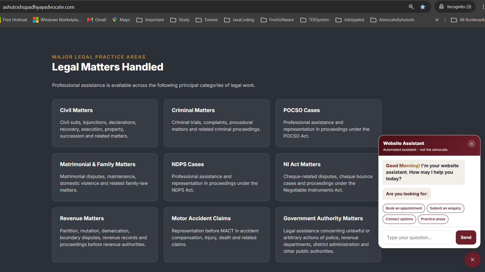
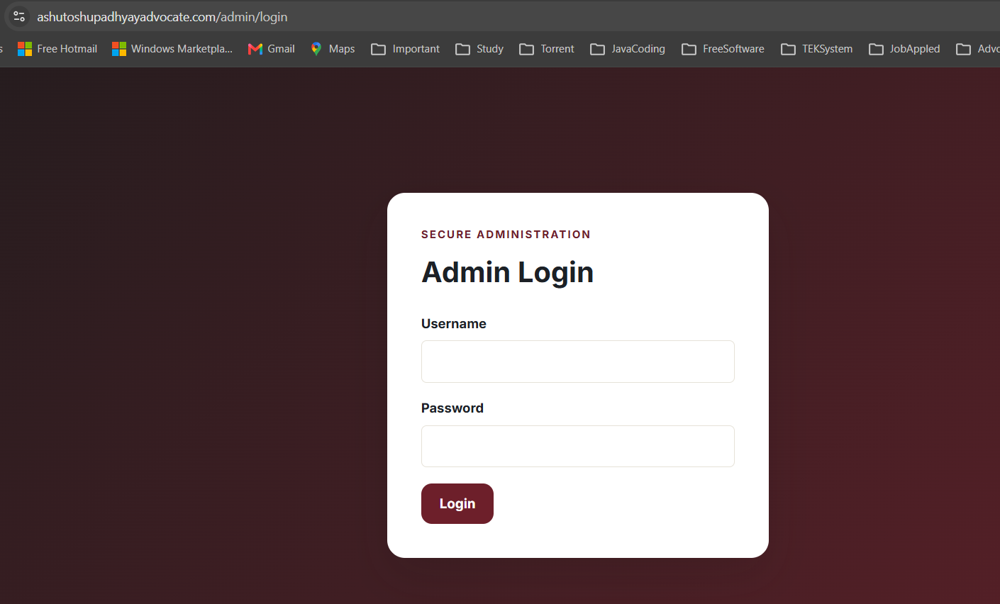
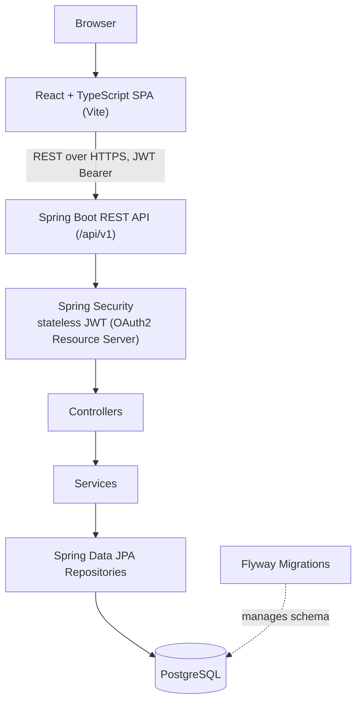
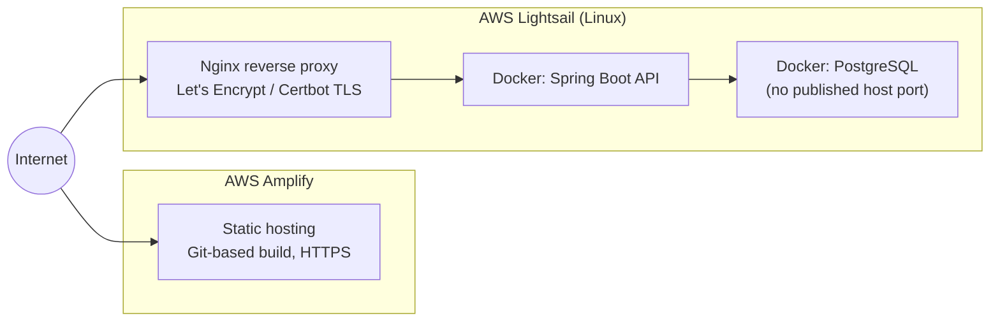

# Ashutosh Upadhyay Advocate — Full-Stack Legal Services Platform

[](https://www.ashutoshupadhyayadvocate.com)
[](https://github.com/Upadhyaybn/ashutosh-upadhyay-advocate/actions/workflows/backend-ci.yml)
[](https://github.com/Upadhyaybn/ashutosh-upadhyay-advocate/releases/tag/v1.0.0)
[](https://www.oracle.com/java/)
[](https://spring.io/projects/spring-boot)
[](https://react.dev/)
[](https://www.typescriptlang.org/)
[](https://www.postgresql.org/)
[](https://aws.amazon.com/)
[](https://www.docker.com/)

A full-stack web application built and operated for a practicing advocate in Siddharthnagar, Uttar Pradesh, India. Actively developed and deployed in production.

<details>
<summary><strong>Table of Contents</strong></summary>

- [Live Application](#live-application)
- [Overview](#overview)
- [Key Engineering Highlights](#key-engineering-highlights)
- [Application Screenshots](#application-screenshots)
- [System Architecture](#system-architecture)
- [Technology Stack](#technology-stack)
- [Backend Architecture](#backend-architecture)
- [API Capabilities](#api-capabilities)
- [End-to-End Feature Flow: Legal Enquiry](#end-to-end-feature-flow-legal-enquiry)
- [Security Design](#security-design)
- [Database & Persistence](#database--persistence)
- [Frontend Architecture](#frontend-architecture)
- [Testing & Quality](#testing--quality)
- [Continuous Integration](#continuous-integration)
- [Containerization](#containerization)
- [Production Deployment](#production-deployment)
- [Troubleshooting](#troubleshooting)
- [Local Development](#local-development)
- [Project Structure](#project-structure)
- [Engineering Decisions & Trade-offs](#engineering-decisions--trade-offs)
- [Engineering Practices Demonstrated](#engineering-practices-demonstrated)
- [Documentation](#documentation)
- [Legal Content & Professional Integrity](#legal-content--professional-integrity)

</details>

## Live Application

| Endpoint | URL |
| --- | --- |
| Public website | [www.ashutoshupadhyayadvocate.com](https://www.ashutoshupadhyayadvocate.com) |
| API | [api.ashutoshupadhyayadvocate.com](https://api.ashutoshupadhyayadvocate.com) |
| Health check | [api.ashutoshupadhyayadvocate.com/actuator/health](https://api.ashutoshupadhyayadvocate.com/actuator/health) |

---

## Overview

The application gives a solo legal practitioner a professional public web presence and a private administration system, replacing what would otherwise be manual phone/in-person enquiry intake. Members of the public can view the advocate's profile and practice areas, submit legal enquiries, and request consultation appointments — in English or Hindi. The advocate authenticates into a separate admin area to triage enquiries and appointments, manage the published profile and practice-area content, and review an audit trail of administrative actions.

Technically, it is a Java/Spring Boot REST API backed by PostgreSQL, consumed by a React/TypeScript single-page application, with stateless JWT authentication, Flyway-managed schema migrations, Testcontainers-backed integration testing, a JaCoCo-enforced coverage gate, and a containerized production deployment across AWS Amplify (frontend) and AWS Lightsail (backend + database).

---

## Key Engineering Highlights

A few implementation details, beyond the technology list below:

- **Layered backend with explicit API boundaries** — controllers never expose JPA entities directly; every response is an explicit DTO.
- **Stateless JWT authentication via Spring Security's OAuth2 Resource Server support** (not a hand-rolled filter) — HS256 signing through Nimbus JOSE, issuer validation, and a minimum-secret-length check that fails application startup rather than running with a weak key.
- **Centralized exception handling** (`@RestControllerAdvice`) that normalizes validation errors, not-found, authentication failures, and unexpected exceptions into one consistent JSON error contract, including field-level validation messages.
- **Schema evolution through immutable Flyway migrations** — every change is a new, sequential, forward-only migration file; nothing already applied is edited.
- **Integration tests run against a real PostgreSQL instance via Testcontainers**, not an in-memory substitute, and a JaCoCo line-coverage gate is wired into `mvn verify` itself — the build fails below the configured threshold.
- **A deliberate, documented trade-off on data deletion**: administrative delete of an enquiry/appointment is a hard delete, but every deletion is written to an independent audit log first, in the same transaction — chosen because the audit table doesn't foreign-key to the deleted row, so the accountability trail survives regardless.
- **A deterministic, rule-based chatbot instead of an LLM integration** — a conscious choice to eliminate hallucination risk, external API cost, and secret-management surface on a site that must not appear to give legal advice.
- **Multi-stage, non-root Docker build**, environment-driven configuration, and idempotent first-run admin provisioning — no credentials or default accounts baked into the image.

---

## Application Screenshots

### Homepage

Hero section, with the bilingual rule-based chatbot open.


### Practice Areas

Category grid with line icons, and the dark "Legal Matters Handled" section.




### Legal Enquiry form


### Appointment request

Calendar and time-slot picker.


### Admin — login and dashboard




---

## System Architecture

### Request flow



### Production infrastructure



The frontend and backend are independently built and deployed — a frontend change does not touch the backend deployment, and vice versa.

---

## Technology Stack

| Layer | Technologies |
| --- | --- |
| Backend | Java 25, Spring Boot 4.1.0, Spring Web MVC, Spring Data JPA (Hibernate), Jakarta Bean Validation, Maven |
| Security | Spring Security, OAuth2 Resource Server (JWT / HS256 via Nimbus JOSE), BCrypt |
| Database | PostgreSQL 18, Flyway |
| API documentation | springdoc-openapi (OpenAPI 3 / Swagger UI) |
| Backend testing | JUnit 5, Spring Boot Test, MockMvc, Testcontainers (PostgreSQL), JaCoCo |
| Frontend | React 19, TypeScript, Vite, React Router 8, Axios, React Helmet Async |
| Frontend UX | react-i18next / i18next (English/Hindi), react-day-picker, date-fns |
| Frontend quality | ESLint, typescript-eslint, TypeScript compiler (`tsc -b`) |
| Containers | Docker (multi-stage backend image), Docker Compose (dev and prod) |
| CI | GitHub Actions |
| Cloud / hosting | AWS Amplify (frontend), AWS Lightsail (backend + database) |
| Networking | Nginx (reverse proxy), Let's Encrypt / Certbot (TLS), custom domain |

---

## Backend Architecture

```text
backend/src/main/java/com/ashutoshupadhyay/advocate/
├── controller/     11 REST controllers — thin, delegate to services
├── service/        business logic and transaction boundaries
├── repository/     Spring Data JPA interfaces
├── entity/         JPA-mapped domain model
├── dto/request/     inbound request payloads (validated)
├── dto/response/    outbound response payloads (entities are never returned directly)
├── config/         SecurityConfig, JwtConfig, CorsConfig, OpenApiConfig, admin bootstrap
├── security/       custom authentication-entry-point / access-denied handlers
└── exception/      GlobalExceptionHandler + domain exceptions
```

**Domain model**: `AdvocateProfile`, `PracticeArea`, `Enquiry`, `Appointment`, `AdminUser`, `AuditLog`.

Controllers are intentionally thin — request mapping, delegation, and response shaping only. Business rules and transactional boundaries live in the service layer. Every admin write (status update, delete, profile edit) that mutates state also writes an `AuditLog` entry in the same transaction, through a single shared `AuditLogService`.

---

## API Capabilities

Base path: `/api/v1`. Full endpoint-level detail (request/response shapes) is generated at runtime via OpenAPI/Swagger UI (`/swagger-ui/index.html`) and additionally described in [`docs/api.md`](docs/api.md).

### Public (no authentication)

- `GET /api/v1/profile` — published advocate profile
- `GET /api/v1/practice-areas`, `GET /api/v1/practice-areas/{slug}`
- `POST /api/v1/enquiries` — submit a legal enquiry
- `POST /api/v1/appointments` — request a consultation appointment
- `POST /api/v1/auth/login` — administrator login
- `GET /api/v1/public/status`, `GET /actuator/health`

### Authenticated

- `GET /api/v1/auth/me` — current authenticated user

### Admin only (`ROLE_ADMIN`, under `/api/v1/admin/**`)

- Enquiries — list, get, update status, **delete**
- Appointments — list, get, update status, **delete**
- Practice areas — list, create, update, update status, **delete**
- Advocate profile — get, update
- Audit logs — list

### Example: submitting an enquiry

Request and response match `EnquiryRequest` and `CreateResponse` exactly as implemented; example data below is illustrative, not real.

```http
POST /api/v1/enquiries
Content-Type: application/json

{
  "fullName": "Ramesh Kumar",
  "mobile": "9876543210",
  "email": "ramesh.kumar@example.com",
  "cityDistrict": "Siddharthnagar",
  "category": "Civil Matter",
  "description": "Need consultation regarding a property boundary dispute.",
  "consent": true
}
```

```json
HTTP/1.1 201 Created

{
  "id": 42,
  "message": "Enquiry submitted successfully"
}
```

`mobile` is validated server-side against `^[6-9][0-9]{9}$`; `fullName`, `description`, and `consent` are required (`@NotBlank` / `@AssertTrue`); a failed validation returns `400` with the same structured error shape described under Security Design.

---

## End-to-End Feature Flow: Legal Enquiry

Tracing one real workflow through every layer, from submission to administrative review.

### Public submission

1. `EnquiryPage.tsx` collects the form via `FormData`, normalizes the mobile number, and runs a client-side format check before calling `submitEnquiry()`.
2. `submitEnquiry()` (`frontend/src/api/publicApi.ts`) sends the payload to `POST /api/v1/enquiries` through a shared Axios client.
3. `EnquiryController.create()` binds the body to the `EnquiryRequest` record; `@Valid` triggers the Bean Validation constraints declared directly on the record (`@NotBlank`, `@Pattern`, `@Size`, `@Email`, `@AssertTrue`) — enforced server-side regardless of what the client sent.
4. `EnquiryService.create()` maps the validated request onto a new `Enquiry` JPA entity, sets its status to `NEW`, and persists it via `EnquiryRepository.save()` inside a single `@Transactional` method. The entity's `@PrePersist` callback stamps `createdAt`/`updatedAt`.
5. The controller returns `201 Created` with the new record's `id`.

### Administrative review

1. The advocate authenticates via `POST /api/v1/auth/login` and receives a JWT with `ROLE_ADMIN`.
2. `GET /api/v1/admin/enquiries` (guarded by `@PreAuthorize("hasRole('ADMIN')")`) lists submissions for review.
3. Updating status (`PATCH /api/v1/admin/enquiries/{id}/status`) moves the record through `NEW → REVIEWED → CONTACTED → APPOINTMENT_SCHEDULED → CLOSED`; deleting (`DELETE /api/v1/admin/enquiries/{id}`) removes it entirely. Both run inside `AdminEnquiryService`, each in a single transaction.
4. Before the mutation completes, `AuditLogService.log()` reads the authenticated principal from `SecurityContextHolder`, resolves the matching `AdminUser`, and writes an `AuditLog` row (action, entity type, entity ID, actor, timestamp) — in the same transaction as the status change or delete, so the two cannot diverge.

---

## Security Design

- **Authentication** — stateless JWT, validated through Spring Security's OAuth2 Resource Server integration (`NimbusJwtDecoder`, HS256, issuer-checked). The signing secret is supplied via configuration and must be at least 32 characters or the application refuses to start.
- **Authorization** — URL-pattern rules require `ROLE_ADMIN` for the entire `/api/v1/admin/**` tree; `@EnableMethodSecurity` is active for method-level checks where used. Authentication and access-denied failures are handled by custom handlers that return a consistent JSON error body rather than Spring's default redirect/HTML behavior.
- **Password storage** — BCrypt, via Spring Security's `PasswordEncoder`.
- **CORS** — an explicit allow-list of known origins (local dev, the production domain, and the Amplify hosting URL); not a wildcard.
- **CSRF** — disabled deliberately: the API is stateless and token-based, with no session cookie to protect.
- **Request validation** — Jakarta Bean Validation on every inbound DTO; failures are normalized into a single structured error response by the global exception handler.
- **Actuator surface** — only `health` and `info` are exposed in production, with health details suppressed.
- **Secrets** — database credentials, admin credentials, and the JWT secret are supplied exclusively through environment variables. Only `*.example` files (placeholder values) are committed; real `.env` files are excluded via `.gitignore`.
- **Admin provisioning** — the initial admin account is created idempotently on startup from environment variables (`AdminBootstrapInitializer`), skipped automatically if one already exists — no default or seeded credentials ship in the codebase.

---

## Database & Persistence

- **Engine**: PostgreSQL 18, accessed through Spring Data JPA / Hibernate.
- **Migrations**: schema is managed exclusively by Flyway. Migrations already applied are never edited — every change ships as a new, sequential file (`V1__create_initial_schema.sql`, `V2__seed_advocate_profile.sql`, `V3__increase_advocate_profile_phone_length.sql`).
- **Core tables**: `advocate_profile`, `practice_area`, `enquiry`, `appointment`, `admin_user`, `audit_log`.
- In the production Compose configuration, PostgreSQL publishes no host port — it is reachable only from the backend container on an internal Docker bridge network, not from the host or the public internet.

---

## Frontend Architecture

- **React 19 + TypeScript**, built with Vite; `npm run build` runs the TypeScript compiler (`tsc -b`) before bundling, so type errors fail the build.
- **Routing** — React Router, with separate public (`/`, `/about`, `/practice-areas`, `/contact`, `/enquiry`, `/appointment`) and admin (`/admin/**`) route trees; admin routes require an authenticated session.
- **API access** — centralized through an Axios-based service layer rather than ad-hoc `fetch` calls scattered through components.
- **Internationalization** — a session-scoped English/Hindi toggle via `react-i18next` (English is always the default for a new session).
- **Scheduling UI** — `react-day-picker` plus a custom time-slot grid for appointment requests.
- **Chatbot widget** — a self-contained, deterministic, rule-based assistant (no external LLM/API call) that answers FAQ-style questions and always shows a fixed disclaimer for anything beyond its scope.
- **SEO** — per-page metadata via `react-helmet-async`, JSON-LD structured data (`LegalService`/`LocalBusiness`), an XML sitemap, and `robots.txt`.
- **Styling** — a single global stylesheet built on a CSS custom-property design-token system (color, spacing, radius, shadow, fluid typography scales); no CSS-in-JS, Tailwind, or CSS Modules.
- **Frontend testing**: there is no automated frontend test suite in this repository (`package.json` defines no `test` script). Frontend correctness is enforced at build time through ESLint and the TypeScript compiler, and through manual verification.

---

## Testing & Quality

- **Backend**: JUnit 5 and Spring Boot Test across controller (MockMvc), service, and integration layers, including dedicated security tests that exercise authenticated, unauthenticated, and forbidden request paths.
- **Integration testing** runs against a real PostgreSQL instance started via **Testcontainers** — not an in-memory database substitute.
- **Coverage gate**: the JaCoCo Maven plugin is wired into the build lifecycle (`prepare-agent` → `report` → `check`) and **enforces a minimum 70% line-coverage threshold** at the `verify` phase — `mvn verify` fails if coverage drops below that.
- At the time of writing, running the full suite locally (`./mvnw verify`) passes **52 tests with 0 failures**, satisfying the configured coverage gate. This figure will change as the codebase grows.
- **Frontend**: no automated test suite exists (see Frontend Architecture above).

---

## Continuous Integration

A single GitHub Actions workflow, [`.github/workflows/backend-ci.yml`](.github/workflows/backend-ci.yml), backend-only:

- **Triggers**: push and pull request to `main`, scoped to `backend/**` and the workflow file itself.
- **Steps**: checkout → set up JDK 25 (Temurin) → `./mvnw verify` → upload the JaCoCo report as a build artifact → build the backend Docker image.

This is verification CI — it runs tests, enforces the coverage gate, and confirms the Docker image builds. It does not push the image to a registry or deploy it; there is no continuous deployment, and no separate frontend CI workflow.

---

## Containerization

- **Backend `Dockerfile`** — two-stage build: `eclipse-temurin:25-jdk` compiles the application, `eclipse-temurin:25-jre` runs it. The runtime stage creates and switches to a non-root `spring` user before starting the JVM.
- **`docker-compose.yml`** (local development) — PostgreSQL + backend, with the database port published to the host for local tooling access.
- **`docker-compose.prod.yml`** (production) — the same two services on an isolated Docker bridge network; PostgreSQL has no published host port, and all secrets (DB credentials, admin credentials, JWT secret) are injected via environment variables at deploy time.

---

## Production Deployment

| | Frontend | Backend |
| --- | --- | --- |
| Build | Vite (`npm run build`) | Maven, multi-stage Docker image |
| Host | AWS Amplify | AWS Lightsail (Linux VM) |
| Serving | Amplify static hosting + HTTPS | Nginx reverse proxy → Docker container |
| TLS | Amplify-managed | Let's Encrypt / Certbot |
| Deploy trigger | Git-based Amplify build | Manual, operator-run |

The backend deployment today is a manual sequence run on the Lightsail host (`git pull`, then `docker compose --env-file .env.prod -f docker-compose.prod.yml up -d --build`) — not an automated pipeline. Full operational detail (health checks, log inspection, backups, certificate renewal, rollback) is documented in [`docs/PRODUCTION_RUNBOOK.md`](docs/PRODUCTION_RUNBOOK.md).

---

## Troubleshooting

Common issues and the first place to look, both locally and in production. Full recovery procedures are in [`docs/PRODUCTION_RUNBOOK.md`](docs/PRODUCTION_RUNBOOK.md).

| Symptom | First check |
| --- | --- |
| `./mvnw verify` fails on coverage | JaCoCo enforces a 70% line-coverage minimum (see Testing & Quality) — new code likely needs matching tests. |
| Integration tests fail with a container/connection error | Docker must be running locally; Testcontainers starts its own PostgreSQL instance per test run. |
| Flyway reports a checksum mismatch | An already-applied migration was edited. Revert the change and add a new sequential migration instead (see Engineering Decisions & Trade-offs). |
| Production health check doesn't return `200` | `curl -i https://api.ashutoshupadhyayadvocate.com/actuator/health`, then on the Lightsail host: `docker ps` and `docker logs --tail 200 advocate-api-prod`. |
| TLS certificate errors in production | `sudo certbot renew --dry-run` on the Lightsail host. |
| Admin login returns `401` | Confirm `ADMIN_USERNAME`/`ADMIN_PASSWORD` are set in the environment the backend was started with — the bootstrap account is only created once, on first startup. |

---

## Local Development

**Prerequisites**: JDK 25, Node.js + npm, Docker (required for the Testcontainers-backed integration tests), Git.

```bash
git clone https://github.com/Upadhyaybn/ashutosh-upadhyay-advocate.git
cd ashutosh-upadhyay-advocate
```

**Backend** — from `backend/`:

```bash
./mvnw spring-boot:run   # run the API locally (mvnw.cmd on Windows)
./mvnw verify             # full test suite + coverage gate — the same command CI runs
```

**Frontend** — from `frontend/`:

```bash
npm install
npm run dev      # local dev server
npm run lint      # eslint .
npm run build     # tsc -b && vite build
```

---

## Project Structure

```text
ashutosh-upadhyay-advocate/
├── .github/workflows/          backend-ci.yml (the only CI workflow)
├── backend/
│   ├── src/main/java/com/ashutoshupadhyay/advocate/
│   │   ├── controller/ service/ repository/ entity/ dto/ config/ security/ exception/
│   ├── src/main/resources/db/migration/    Flyway migrations
│   ├── src/test/java/...                   controller, service, integration tests
│   ├── Dockerfile
│   └── pom.xml
├── frontend/
│   ├── src/
│   │   ├── pages/{public,admin}/  components/  layouts/  hooks/  i18n/  api/  routes/
│   └── package.json
├── docs/
│   ├── api.md  architecture.md  database.md  deployment.md  security.md
│   └── PRODUCTION_RUNBOOK.md
├── docker-compose.yml
├── docker-compose.prod.yml
└── README.md
```

---

## Engineering Decisions & Trade-offs

| Decision | Alternative considered | Reasoning |
| --- | --- | --- |
| Hard delete for enquiries/appointments, paired with a transaction-scoped audit log | Soft delete (`deleted_at` flag) | `AuditLog.entityId` is not a foreign key to the deleted row, so the audit record's integrity does not depend on the row still existing. A soft-delete flag would also require retrofitting every list query to filter it out. |
| Symmetric JWT signing (HS256, one shared secret) | Asymmetric signing (RS256, public/private key pair) | This service is both the sole issuer and sole verifier of its tokens — there is no separate identity provider or second resource server that would need the public key distributed to it, so a shared secret is simpler to operate. |
| Deterministic, rule-based chatbot | LLM-backed assistant | Eliminates hallucination risk, an external API dependency/cost, and an additional secret to manage, for a feature that only needs to answer a fixed set of FAQ-style questions on a site that should not appear to give legal advice. |
| CSRF protection disabled | Leaving Spring Security's default CSRF filter enabled | The API is stateless and bearer-token authenticated with no session cookie; CSRF protection defends cookie-based session auth, which this system does not use. |
| Flyway migrations are forward-only and never edited after being applied | Editing existing migration files directly | Maintains consistent, version-controlled migration history across environments and avoids checksum conflicts caused by modifying applied migrations. |
| Internationalization (English/Hindi) implemented only in the frontend | Full-stack localization via a Spring `MessageSource` | API error messages and validation text remain English-only; there is no backend message-resolution infrastructure. This keeps translation scoped to the UI copy that public visitors actually read. |

---

## Engineering Practices Demonstrated

The repository demonstrates:

- Layered backend architecture with explicit controller/service/repository separation and DTO-bounded APIs (entities are never serialized directly).
- Centralized, consistent error handling across validation, not-found, authentication, and unexpected-exception cases.
- Stateless JWT authentication built on Spring Security's standard OAuth2 Resource Server support, with URL/method-level authorization and custom 401/403 handling.
- Schema evolution managed through immutable, sequential Flyway migrations.
- Integration testing against a real database engine via Testcontainers, alongside unit and MockMvc controller tests.
- A code-coverage gate enforced inside the build lifecycle, not merely measured after the fact.
- A multi-stage, non-root Docker runtime image.
- CI that gates on tests, coverage, and a successful container build on every push/PR to `main`.
- Environment-driven configuration and idempotent first-run provisioning — no credentials committed to source.
- Deliberate, documented trade-offs rather than default choices (see Engineering Decisions & Trade-offs above).
- A frontend that treats internationalization, accessible focus states, and `prefers-reduced-motion` support as first-class concerns.

---

## Documentation

Supplementary documentation lives under [`docs/`](docs/):

- [`docs/api.md`](docs/api.md) — API reference
- [`docs/architecture.md`](docs/architecture.md) — architecture notes
- [`docs/database.md`](docs/database.md) — database design notes
- [`docs/deployment.md`](docs/deployment.md) — deployment notes
- [`docs/security.md`](docs/security.md) — security baseline notes
- [`docs/PRODUCTION_RUNBOOK.md`](docs/PRODUCTION_RUNBOOK.md) — production operations runbook

Some of these files were written early in the project's development and have not all been updated to match the current implementation. This README reflects the verified current state of the codebase; where the two differ, this README takes precedence.

---

## Legal Content & Professional Integrity

The public site is informational. Professional details, practice areas, and credentials reflect information confirmed by the advocate, and the site deliberately avoids unsupported claims such as guaranteed outcomes, "best"/"No. 1" comparative statements, or other misleading professional claims.

Practice areas currently presented include civil, criminal, POCSO, matrimonial and family, NDPS, Negotiable Instruments Act, revenue, Motor Accident Claims Tribunal (MACT), and government-authority matters.

---

**Production**: [www.ashutoshupadhyayadvocate.com](https://www.ashutoshupadhyayadvocate.com) · **API**: [api.ashutoshupadhyayadvocate.com](https://api.ashutoshupadhyayadvocate.com)

Built by [Upadhyaybn](https://github.com/Upadhyaybn).
