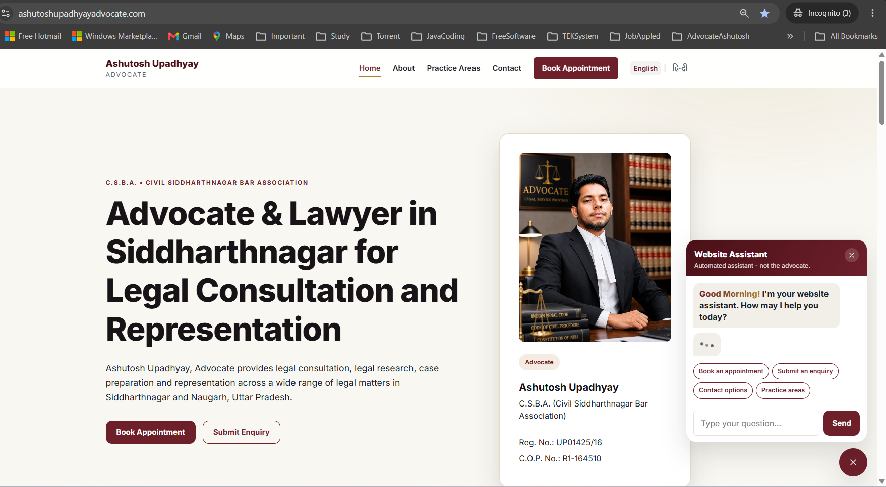

# ⚖️ Ashutosh Upadhyay Advocate — Full-Stack Production Web Application

[](https://www.ashutoshupadhyayadvocate.com)
[](https://github.com/Upadhyaybn/ashutosh-upadhyay-advocate/releases/tag/v1.0.0)
[](https://www.oracle.com/java/)
[](https://spring.io/projects/spring-boot)
[](https://react.dev/)
[](https://www.postgresql.org/)
[](https://aws.amazon.com/)
[](https://www.docker.com/)

A production-grade full-stack web application independently designed, developed, tested, secured, deployed, and productionized for a practicing legal professional in Siddharthnagar, Uttar Pradesh, India.

The project demonstrates end-to-end ownership across **Java backend engineering, React frontend development, REST API design, authentication and authorization, relational database design, automated testing, containerization, AWS deployment, HTTPS, DNS, SEO, monitoring, backup, and production operations**.

> **Production Release:** `v1.0.0`  
> **Application Status:** 🟢 Live

---

## 🌐 Live Application

### Production Website

**https://www.ashutoshupadhyayadvocate.com**

### Production API

**https://api.ashutoshupadhyayadvocate.com**

### API Health

**https://api.ashutoshupadhyayadvocate.com/actuator/health**

---

## 👨‍💻 Engineering Ownership

This application was independently engineered as an end-to-end client project.

My responsibilities covered the complete software development lifecycle:

- Requirements analysis
- Solution architecture
- Backend API design and development
- Frontend development
- Database design
- Authentication and authorization
- Input validation and exception handling
- Database migration management
- Automated unit and integration testing
- Containerization
- AWS infrastructure setup
- Production deployment
- DNS and custom-domain configuration
- HTTPS/TLS configuration
- Production security hardening
- SEO implementation
- Responsive design
- Production QA
- Database backup
- Infrastructure snapshot
- Monitoring and health checks
- Technical documentation
- Git release management

The goal was not only to build a functional website, but to take the application through a complete **development → testing → deployment → production → maintenance lifecycle**.

---

# 📌 Business Problem

A practicing advocate required a professional online presence through which prospective clients could:

- Understand the advocate's professional profile
- Explore legal practice areas
- Find office and contact information
- Submit legal enquiries
- Request appointments
- Access the website across desktop and mobile devices

The advocate also required a secured administrative interface for managing incoming enquiries, appointments, practice information, and profile data without modifying application source code.

---

# 💡 Solution

The solution is a full-stack web platform consisting of:

1. A public **React + TypeScript Single Page Application**
2. A **Java 25 / Spring Boot REST API**
3. A secured **JWT-based administrative portal**
4. A **PostgreSQL 18 relational database**
5. **Flyway** database versioning
6. Dockerized backend infrastructure
7. AWS-based production deployment
8. Nginx reverse proxy with HTTPS
9. Automated backend testing using JUnit and Testcontainers
10. Production monitoring, backup, SEO, and operational documentation

---

# 🏗️ Production Architecture

```text
                           Internet
                              │
                              ▼
               ashutoshupadhyayadvocate.com
                              │
                   ┌──────────┴──────────┐
                   │                     │
                   ▼                     ▼
              AWS Amplify           API Subdomain
                   │                     │
                   │                     ▼
          React + TypeScript           Nginx
              Vite SPA                  │
                   │                     │
                   │ HTTPS REST API      ▼
                   └──────────────► AWS Lightsail
                                         │
                                         ▼
                                   Docker Compose
                                    ┌────┴─────┐
                                    │          │
                                    ▼          ▼
                              Spring Boot   PostgreSQL
                                  API           18
                                    │
                                    ▼
                               Flyway / JPA
```

### Request Flow

```text
Browser
   │
   ▼
React Frontend
   │
   │ HTTPS / JSON
   ▼
Nginx Reverse Proxy
   │
   ▼
Spring Boot REST API
   │
   ├── Spring Security / JWT
   ├── Validation
   ├── Service Layer
   ├── JPA / Hibernate
   │
   ▼
PostgreSQL
```

---

# 🛠️ Technology Stack

## Frontend

| Technology | Purpose |
|---|---|
| React | Component-based frontend |
| TypeScript | Type-safe frontend development |
| Vite | Development and production build tooling |
| React Router | Client-side routing |
| Axios | REST API communication |
| Custom CSS | Responsive UI and styling |
| React Helmet Async | SEO metadata management |

---

## Backend

| Technology | Purpose |
|---|---|
| Java 25 | Backend programming language |
| Spring Boot 4.1.0 | Application framework |
| Spring Security | Authentication and authorization |
| Spring Data JPA | Persistence abstraction |
| Hibernate | ORM |
| Jakarta Bean Validation | Request validation |
| JWT | Stateless admin authentication |
| REST | API architecture |
| OpenAPI / Springdoc | API documentation |
| Maven | Build and dependency management |
| Spring Boot Actuator | Application health monitoring |

---

## Database

| Technology | Purpose |
|---|---|
| PostgreSQL 18 | Production relational database |
| Flyway | Database schema versioning |
| JPA / Hibernate | Object-relational mapping |

---

## Testing & Quality

| Technology | Purpose |
|---|---|
| JUnit | Unit and integration testing |
| Spring Boot Test | Application-context testing |
| MockMvc | Controller/API testing |
| Mockito | Unit-test mocking |
| Testcontainers | Real PostgreSQL integration testing |
| JaCoCo | Code coverage verification |

---

## DevOps & Cloud

| Technology | Purpose |
|---|---|
| AWS Amplify | Frontend hosting and deployment |
| AWS Lightsail | Backend production server |
| Docker | Application containerization |
| Docker Compose | Production service orchestration |
| Nginx | Reverse proxy |
| Let's Encrypt | TLS certificate |
| Certbot | Certificate management and renewal |
| GitHub Actions | CI workflow |
| Git / GitHub | Source control |
| Namecheap DNS | Domain/DNS management |

---

# ✨ Key Features

## Public Website

The public application provides:

- Professional advocate profile
- Practice-area information
- Office and contact details
- Responsive desktop/mobile interface
- Legal enquiry submission
- Appointment request functionality
- Contact and WhatsApp information
- SEO-friendly public pages
- Structured metadata for search engines
- Legal/professional disclaimer

---

## 🔐 Secured Admin Portal

The administrative interface supports:

- Secure admin authentication
- JWT-based authorization
- Admin dashboard
- Advocate profile management
- Practice-area management
- Enquiry management
- Appointment management
- Enquiry status workflow
- Appointment status workflow
- Audit-log visibility
- Secure logout

Administrative APIs are protected under:

```text
/api/v1/admin/**
```

and require authenticated administrative access.

---

# 🔐 Authentication Architecture

The admin application uses stateless JWT authentication.

```text
Admin
   │
   │ Username + Password
   ▼
POST /api/v1/auth/login
   │
   ▼
Spring Security
   │
   ▼
Credential Verification
   │
   ▼
JWT Generated
   │
   ▼
React Admin Client
   │
   │ Authorization: Bearer <JWT>
   ▼
Protected /api/v1/admin/** APIs
```

Security principles implemented include:

- Stateless authentication
- BCrypt password hashing
- Role-based administrative authorization
- Protected administrative APIs
- Request validation
- CORS configuration
- Restricted production infrastructure ports
- Secrets excluded from source control
- HTTPS communication

---

# 🌐 REST API Design

## Public APIs

| Method | Endpoint | Description |
|---|---|---|
| `GET` | `/api/v1/profile` | Retrieve advocate profile |
| `GET` | `/api/v1/practice-areas` | Retrieve practice areas |
| `GET` | `/api/v1/practice-areas/{slug}` | Retrieve practice-area details |
| `POST` | `/api/v1/enquiries` | Submit legal enquiry |
| `POST` | `/api/v1/appointments` | Request appointment |

---

## Authentication

| Method | Endpoint | Description |
|---|---|---|
| `POST` | `/api/v1/auth/login` | Authenticate administrator and issue JWT |

---

## Administrative APIs

Administrative functionality is exposed through protected endpoints under:

```text
/api/v1/admin/**
```

These APIs support management of:

- Advocate profile
- Practice areas
- Enquiries
- Appointments
- Status workflows
- Audit information

---

# 🗄️ Database Design

The application uses PostgreSQL as the production relational database.

Core tables include:

```text
advocate_profile
practice_area
enquiry
appointment
admin_user
audit_log
```

The persistence layer uses:

```text
Spring Data JPA
      │
      ▼
Hibernate ORM
      │
      ▼
PostgreSQL 18
```

---

# 🔄 Database Migration Strategy

Database changes are managed using Flyway.

Current production migrations:

```text
V1__create_initial_schema.sql
V2__seed_advocate_profile.sql
V3__increase_advocate_profile_phone_length.sql
```

The database reached schema version:

```text
v3
```

A key production rule followed by the project is:

> Previously applied Flyway migrations are never modified. New database changes are introduced through new versioned migrations.

For example:

```text
V4__new_change.sql
V5__another_change.sql
```

---

# 📩 Enquiry Workflow

```text
Visitor
   │
   ▼
Enquiry Form
   │
   ▼
POST /api/v1/enquiries
   │
   ▼
Request Validation
   │
   ▼
Spring Service Layer
   │
   ▼
PostgreSQL
   │
   ▼
Admin Portal
```

Administrative enquiry lifecycle:

```text
New
 │
 ▼
Reviewed
 │
 ▼
Contacted
 │
 ▼
Appointment Scheduled
 │
 ▼
Closed
```

This workflow was verified through production end-to-end testing.

---

# 📅 Appointment Workflow

```text
Visitor
   │
   ▼
Appointment Form
   │
   ▼
POST /api/v1/appointments
   │
   ▼
Validation
   │
   ▼
Service Layer
   │
   ▼
PostgreSQL
   │
   ▼
Admin Portal
```

Appointment status workflow includes:

```text
Requested
Reviewed
Confirmed
Completed
Cancelled
```

The appointment flow was also validated end-to-end in production.

---

# 🧪 Automated Testing

The backend contains automated tests across controllers, services, security, application configuration, and PostgreSQL integration.

The final `v1.0.0` production quality gate completed with:

```text
Tests run: 40
Failures: 0
Errors: 0
Skipped: 0
```

JaCoCo verification:

```text
All coverage checks have been met.
BUILD SUCCESS
```

---

## Testcontainers Integration

Integration tests use Testcontainers to run tests against a real PostgreSQL container rather than relying exclusively on an in-memory database.

```text
JUnit Integration Test
        │
        ▼
Testcontainers
        │
        ▼
PostgreSQL Container
        │
        ▼
Flyway Migrations
        │
        ▼
Spring Data JPA
```

This validates application behavior against infrastructure closer to the production database environment.

---

# 🚀 Frontend Deployment

The frontend deployment workflow is:

```text
React / TypeScript Change
          │
          ▼
    npm run build
          │
          ▼
       Git Commit
          │
          ▼
       Git Push
          │
          ▼
     AWS Amplify
          │
          ▼
  Production Deployment
```

AWS Amplify provides production hosting for the React application and is connected to the repository deployment workflow.

---

# 🐳 Backend Containerization

The Spring Boot API is containerized using Docker.

Production uses Docker Compose to operate:

```text
Docker Compose
     │
     ├── advocate-api-prod
     │        │
     │        ▼
     │   Spring Boot
     │
     └── advocate-postgres-prod
              │
              ▼
         PostgreSQL 18
```

The API is not directly exposed through its internal application port to the public internet.

Nginx acts as the public reverse proxy.

---

# ☁️ AWS Production Deployment

## Frontend

```text
GitHub
   │
   ▼
AWS Amplify
   │
   ▼
React Production Application
```

## Backend

```text
Internet
   │
   ▼
HTTPS :443
   │
   ▼
Nginx
   │
   ▼
Docker
   │
   ▼
Spring Boot
   │
   ▼
PostgreSQL
```

Backend infrastructure runs on an AWS Lightsail instance.

---

# 🔒 Production Network Security

Public production traffic is restricted to required services.

| Port | Purpose | Access |
|---|---|---|
| `80` | HTTP | Public |
| `443` | HTTPS | Public |
| `22` | SSH | Restricted |
| `8080` | Spring Boot | Not publicly exposed through Lightsail firewall |
| `5432` | PostgreSQL | Not publicly exposed |

Production credentials and secrets are maintained outside source control.

Examples include:

```text
DB_PASSWORD
ADMIN_PASSWORD
JWT_SECRET
```

Production environment files such as `.env.prod` must never be committed.

---

# 🔐 HTTPS / TLS

The production API uses:

```text
Nginx
   │
   ▼
Let's Encrypt Certificate
   │
   ▼
HTTPS
```

Certificate renewal is managed through Certbot.

Renewal configuration was validated using:

```bash
sudo certbot renew --dry-run
```

---

# ❤️ Production Health Monitoring

Spring Boot Actuator provides production health information.

Health endpoint:

```text
https://api.ashutoshupadhyayadvocate.com/actuator/health
```

Expected healthy state:

```json
{
  "status": "UP"
}
```

Sensitive Actuator endpoints remain protected.

---

# 💾 Backup & Recovery

Production-readiness work included database and infrastructure backup procedures.

## PostgreSQL Backup

Database backups can be created from the production container using `pg_dump`.

Example operational pattern:

```bash
docker exec advocate-postgres-prod sh -c \
'pg_dump -U "$POSTGRES_USER" "$POSTGRES_DB"' \
> ~/backups/ashutosh_advocate_db_$(date +%Y%m%d_%H%M%S).sql
```

## Infrastructure Backup

AWS Lightsail snapshots provide an additional recovery mechanism for the production server.

Backup and recovery procedures are documented in:

```text
docs/PRODUCTION_RUNBOOK.md
```

---

# 🔎 SEO Implementation

Technical SEO work includes:

- Canonical URLs
- Page-specific metadata
- Search-engine-friendly page titles/descriptions
- `robots.txt`
- XML sitemap
- Google Search Console
- Structured data / JSON-LD
- LegalService structured data
- Organization information
- Responsive/mobile optimization
- Search indexing verification
- Rich Results validation

Production sitemap:

```text
https://www.ashutoshupadhyayadvocate.com/sitemap-v2.xml
```

---

# 📱 Responsive Design

The application was manually validated across multiple viewport sizes including:

```text
320 × 568
390 × 844
768 × 1024
1024 × 768
```

Responsive improvements included:

- Flexible content sizing
- Mobile navigation
- Text wrapping
- Responsive grids
- Image sizing
- Form responsiveness
- Overflow prevention
- Tablet/desktop breakpoints

---

# 📊 Audit Logging

Administrative operations generate audit information to improve traceability.

Audit records capture information such as:

- Administrative action
- Entity type
- Entity identifier
- Acting user
- Timestamp

This provides operational visibility for important administrative changes.

---

# ⚙️ CI / Quality Workflow

The project uses GitHub Actions as part of its source-control and quality workflow.

Typical development flow:

```text
Code Change
    │
    ▼
Local Testing
    │
    ├── Backend: Maven verify
    │
    └── Frontend: Vite production build
    │
    ▼
Git Commit
    │
    ▼
GitHub
    │
    ▼
CI / Deployment
```

---

# 📁 Repository Structure

```text
ashutosh-upadhyay-advocate/
│
├── backend/
│   ├── src/
│   │   ├── main/
│   │   │   ├── java/
│   │   │   └── resources/
│   │   │       └── db/
│   │   │           └── migration/
│   │   └── test/
│   ├── Dockerfile
│   ├── pom.xml
│   ├── mvnw
│   └── mvnw.cmd
│
├── frontend/
│   ├── public/
│   ├── src/
│   ├── package.json
│   └── vite.config.*
│
├── docs/
│   ├── api.md
│   ├── architecture.md
│   ├── database.md
│   ├── deployment.md
│   ├── security.md
│   └── PRODUCTION_RUNBOOK.md
│
├── .github/
│   └── workflows/
│
├── docker-compose.yml
├── docker-compose.prod.yml
├── .gitignore
└── README.md
```

---

# 💻 Local Development

## Prerequisites

Recommended development environment:

```text
Java 25
Maven / Maven Wrapper
Node.js
npm
PostgreSQL
Docker Desktop
Git
```

---

## Backend

Navigate to:

```bash
cd backend
```

Run tests:

```bash
./mvnw test
```

Windows:

```bat
mvnw.cmd test
```

Run the full Maven quality gate:

```bat
mvnw.cmd verify
```

Run the application locally:

```bat
mvnw.cmd spring-boot:run
```

---

## Frontend

Navigate to:

```bash
cd frontend
```

Install dependencies:

```bash
npm install
```

Start development server:

```bash
npm run dev
```

Production build:

```bash
npm run build
```

---

# 🚢 Production Backend Deployment

Production deployment is documented in detail in:

```text
docs/PRODUCTION_RUNBOOK.md
```

The high-level deployment process is:

```text
GitHub
   │
   ▼
AWS Lightsail
   │
   ▼
git pull
   │
   ▼
Docker Compose Build
   │
   ▼
Spring Boot + PostgreSQL
   │
   ▼
Health Verification
```

Production code should not be manually edited directly on the server.

---

# 🧯 Production Troubleshooting Strategy

The production troubleshooting sequence is intentionally systematic:

```text
1. Verify frontend availability
          │
          ▼
2. Verify AWS Amplify deployment
          │
          ▼
3. Check API health
          │
          ▼
4. Check Docker containers
          │
          ▼
5. Inspect backend logs
          │
          ▼
6. Verify Nginx / HTTPS
          │
          ▼
7. Verify PostgreSQL
          │
          ▼
8. Review recent Git changes
```

Common operational commands include:

```bash
docker ps
```

```bash
curl -i https://api.ashutoshupadhyayadvocate.com/actuator/health
```

```bash
docker logs --tail 100 advocate-api-prod
```

---

# 🧠 Engineering Challenges Solved

This project involved more than implementing CRUD functionality.

Some of the engineering and production problems addressed during development included:

### 1. Secure Administrative Authentication

Implemented Spring Security with JWT-based stateless authentication and role-protected administrative APIs.

### 2. Production Database Versioning

Introduced Flyway migrations so database changes remain reproducible and version controlled across environments.

### 3. Real PostgreSQL Integration Testing

Used Testcontainers to validate persistence and Flyway behavior against PostgreSQL rather than depending only on mocked or in-memory infrastructure.

### 4. Frontend / Backend Production Integration

Configured the React application to communicate securely with a separately hosted Spring Boot API while maintaining appropriate production CORS configuration.

### 5. Dockerized Production Backend

Containerized Spring Boot and PostgreSQL and deployed them through Docker Compose on AWS Lightsail.

### 6. HTTPS Reverse Proxy

Configured Nginx and Let's Encrypt/Certbot to provide secure HTTPS access to the API.

### 7. Responsive UI Debugging

Identified and corrected mobile horizontal-overflow and layout issues across multiple viewport sizes.

### 8. Production Data Schema Evolution

Introduced a new Flyway migration when an existing production field required a larger database column rather than modifying an already-applied migration.

### 9. Production Backup and Recovery

Implemented database backup procedures and infrastructure snapshot strategy.

### 10. Search Engine Readiness

Configured canonical URLs, metadata, sitemap, robots directives, structured data, Search Console, and production indexing checks.

---

# 📚 Engineering Skills Demonstrated

This project demonstrates practical experience across:

### Backend Engineering

- Java
- Spring Boot
- REST API design
- Spring Security
- JWT
- JPA / Hibernate
- Validation
- Exception handling
- Layered architecture
- Audit logging

### Database Engineering

- PostgreSQL
- Relational schema design
- Flyway migrations
- Production schema evolution
- Database backup

### Testing

- JUnit
- Mockito
- MockMvc
- Spring Boot integration testing
- Testcontainers
- JaCoCo

### Frontend Engineering

- React
- TypeScript
- REST integration
- Responsive design
- Routing
- Forms and validation
- Admin UI

### DevOps / Cloud

- AWS Amplify
- AWS Lightsail
- Docker
- Docker Compose
- Nginx
- HTTPS / TLS
- DNS
- GitHub Actions
- Production monitoring
- Backup and recovery

### Software Delivery

- Git
- GitHub
- Release tagging
- Environment configuration
- Production troubleshooting
- Technical documentation
- Client requirement implementation

---

# 📖 Production Documentation

Detailed operational documentation is maintained in:

```text
docs/PRODUCTION_RUNBOOK.md
```

It contains production procedures for:

- Deployment
- Health checks
- Logs
- Restart procedures
- Database migrations
- Database backups
- Lightsail snapshots
- HTTPS certificates
- Security
- Admin operations
- Testing
- Monitoring
- Rollback guidance
- Production change management

---

# 🏷️ Release

Current stable production release:

```text
v1.0.0
```

The release represents the first complete production baseline covering:

- Public website
- Backend REST API
- PostgreSQL database
- Admin portal
- Authentication
- Enquiry workflow
- Appointment workflow
- Testing
- AWS deployment
- HTTPS
- SEO
- Responsive design
- Monitoring
- Backup
- Documentation

---

# 🔄 Future Development Workflow

All changes after `v1.0.0` follow a controlled workflow:

```text
Requirement
    │
    ▼
Local Development
    │
    ▼
Automated Tests
    │
    ▼
Production Build
    │
    ▼
Local Verification
    │
    ▼
Git Commit / Push
    │
    ├───────────────┐
    ▼               ▼
AWS Amplify     AWS Lightsail
Frontend        Backend
    │               │
    └───────┬───────┘
            ▼
    Production Verification
            │
            ▼
        Monitoring
```

---

# 📸 Application Screenshots

> Production screenshots can be added here to provide a quick visual overview for recruiters, interviewers, developers, and contributors.

Recommended screenshots:

```text
docs/images/homepage-desktop.png
docs/images/homepage-mobile.png
docs/images/practice-areas.png
docs/images/admin-dashboard.png
docs/images/admin-enquiries.png
```

Example Markdown after screenshots are added:

```markdown
### Public Homepage



### Mobile Experience


### Admin Dashboard


```

---

# 🎯 Project Outcome

The project progressed through the complete engineering lifecycle:

```text
Requirements
      │
      ▼
Architecture
      │
      ▼
Backend Development
      │
      ▼
Database Design
      │
      ▼
Security
      │
      ▼
Frontend Development
      │
      ▼
Automated Testing
      │
      ▼
Dockerization
      │
      ▼
AWS Infrastructure
      │
      ▼
Production Deployment
      │
      ▼
DNS + HTTPS
      │
      ▼
SEO
      │
      ▼
Production QA
      │
      ▼
Security Hardening
      │
      ▼
Backup + Monitoring
      │
      ▼
Documentation
      │
      ▼
Production Release v1.0.0
```

The result is a real production application rather than a local-only demonstration project.

---

# ⚠️ Security Notice

This repository must never contain production secrets.

The following must remain outside version control:

- Database passwords
- Administrator passwords
- JWT signing secrets
- AWS credentials
- Private keys
- Production environment files
- Certificates containing private keys
- Any other confidential client or infrastructure credentials

Example:

```text
.env
.env.prod
*.key
```

Secrets shown in documentation must always be placeholders rather than actual production values.

---

# ⚖️ Professional & Content Compliance

The application is intended to provide factual professional information and facilitate contact/enquiry workflows.

Professional details, qualifications, memberships, practice areas, registration information, and other factual claims should be confirmed by the client before publication.

The application avoids unsupported comparative or promotional claims and does not guarantee legal outcomes.

---

# 👨‍💻 Developer Note

This project was independently designed and implemented as a real client application with emphasis on production-grade Java backend engineering and complete software-delivery ownership.

It demonstrates the ability to take a requirement from initial design through:

**architecture → development → security → testing → cloud deployment → production operations → maintenance.**

---

## ⭐ Portfolio Highlights

If you are reviewing this repository from an engineering perspective, the key areas to explore are:

- **Java 25 / Spring Boot 4 backend architecture**
- **Spring Security + JWT authentication**
- **REST API design**
- **PostgreSQL + Flyway schema management**
- **JUnit + Testcontainers integration testing**
- **JaCoCo quality gates**
- **React + TypeScript frontend**
- **Dockerized production services**
- **AWS Amplify + AWS Lightsail deployment**
- **Nginx + HTTPS**
- **Production security and monitoring**
- **SEO and responsive design**
- **Backup, recovery, and operational documentation**

---

## 📬 Production Website

**Ashutosh Upadhyay, Advocate**

🌐 **https://www.ashutoshupadhyayadvocate.com**

---

**Release:** `v1.0.0`  
**Status:** 🟢 Production  
**Architecture:** Full-Stack Web Application  
**Primary Engineering Focus:** Java • Spring Boot • React • PostgreSQL • Docker • AWS